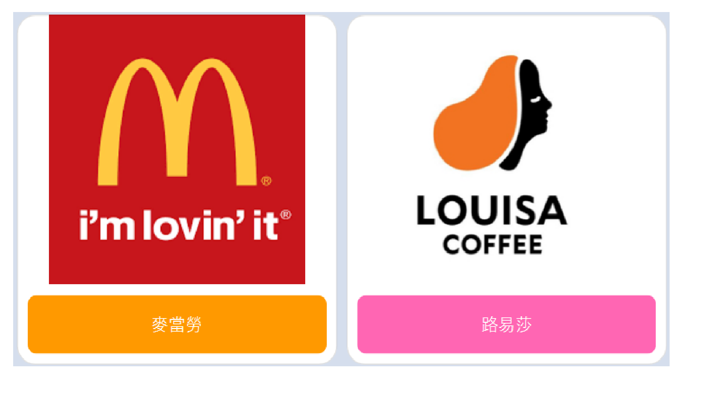

# TOC Project 2020

Template Code for TOC Project 2020

A Line bot based on a finite state machine

## Setup

### Prerequisite
* Python 3.6
* Pipenv
* Line Developer
* HTTPS Server

#### Install Dependency
```sh
pip3 install pipenv
```

* pygraphviz (For visualizing Finite State Machine)
    * [Setup pygraphviz on Ubuntu](http://www.jianshu.com/p/a3da7ecc5303)
	* [Note: macOS Install error](https://github.com/pygraphviz/pygraphviz/issues/100)

* GVedit (Graphviz)
	* [Setup GVedit](https://www.npackd.org/p/org.graphviz.Graphviz/2.38?fbclid=IwAR3BOz_YmEFW9tfguDnE4bTIg_uV4NW6D5h3l8CzcLj-siFB48vb1BVS4EE)
	* [reference](https://blog.csdn.net/lanchunhui/article/details/49472949?fbclid=IwAR36vgJ4AJ9KLAoNB5MyQaW-7yjQcNmz2I05BLmSqbOkaOQG7frwrIYiR6k)

#### Run the sever

```sh
python3 app.py
```

## Finite State Machine


## Usage
The initial state is set to `user`.

Every time `user` state is triggered to `advance` to another state, it will `go_back` to `user` state after the bot replies corresponding message.

* user
	* Input: "menu"
		* Reply: Show the choice of the menu

	


	* Input: "麥當勞"
		* Reply: Randomly show two combination of food and snack
	
	


	* Input: "路易莎"
		* Reply: Randomly show two combination of food and drink
	
	

* First,  input "menu" to wake user interface up
* Second, put one of the buttons of "麥當勞" or "路易莎" and it will provide user two recommendations of the meal
* Third,  input "menu" again to get the user interface again

## Deploy
Setting to deploy webhooks on Heroku.

### Heroku CLI installation

* [macOS, Windows](https://devcenter.heroku.com/articles/heroku-cli)

or you can use Homebrew (MAC)
```sh
brew tap heroku/brew && brew install heroku
```

or you can use Snap (Ubuntu 16+)
```sh
sudo snap install --classic heroku
```

### Connect to Heroku

1. Register Heroku: https://signup.heroku.com

2. Create Heroku project from website

3. CLI Login

	`heroku login`

### Upload project to Heroku

1. Add local project to Heroku project

	heroku git:remote -a {HEROKU_APP_NAME}

2. Upload project

	```
	git add .
	git commit -m "Add code"
	git push -f heroku master
	```

3. Set Environment - Line Messaging API Secret Keys

	```
	heroku config:set LINE_CHANNEL_SECRET=your_line_channel_secret
	heroku config:set LINE_CHANNEL_ACCESS_TOKEN=your_line_channel_access_token
	```

4. Your Project is now running on Heroku!

	url: `{HEROKU_APP_NAME}.herokuapp.com/callback`

	debug command: `heroku logs --tail --app {HEROKU_APP_NAME}`

5. If fail with `pygraphviz` install errors

	run commands below can solve the problems
	```
	heroku buildpacks:set heroku/python
	heroku buildpacks:add --index 1 heroku-community/apt
	```

	refference: https://hackmd.io/@ccw/B1Xw7E8kN?type=view#Q2-如何在-Heroku-使用-pygraphviz

## Reference
[Pipenv](https://medium.com/@chihsuan/pipenv-更簡單-更快速的-python-套件管理工具-135a47e504f4) ❤️ [@chihsuan](https://github.com/chihsuan)

[TOC-Project-2019](https://github.com/winonecheng/TOC-Project-2019) ❤️ [@winonecheng](https://github.com/winonecheng)

Flask Architecture ❤️ [@Sirius207](https://github.com/Sirius207)

[Line line-bot-sdk-python](https://github.com/line/line-bot-sdk-python/tree/master/examples/flask-echo)
